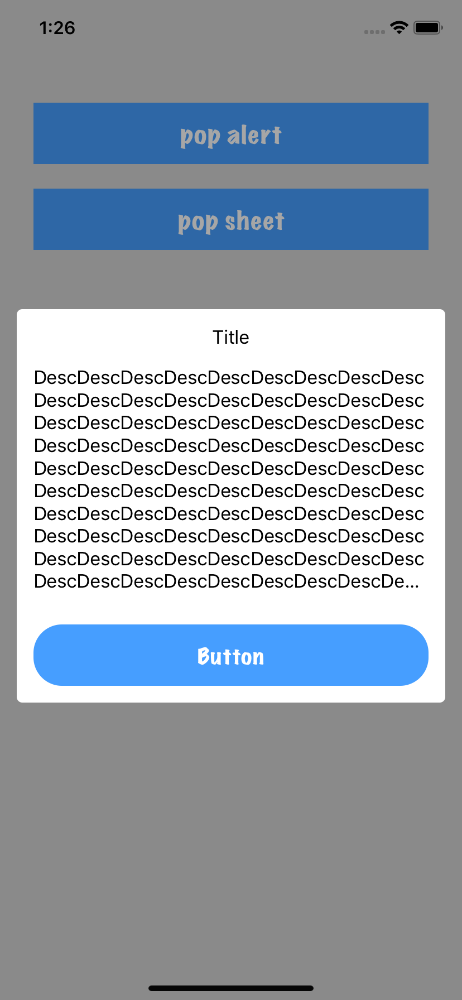
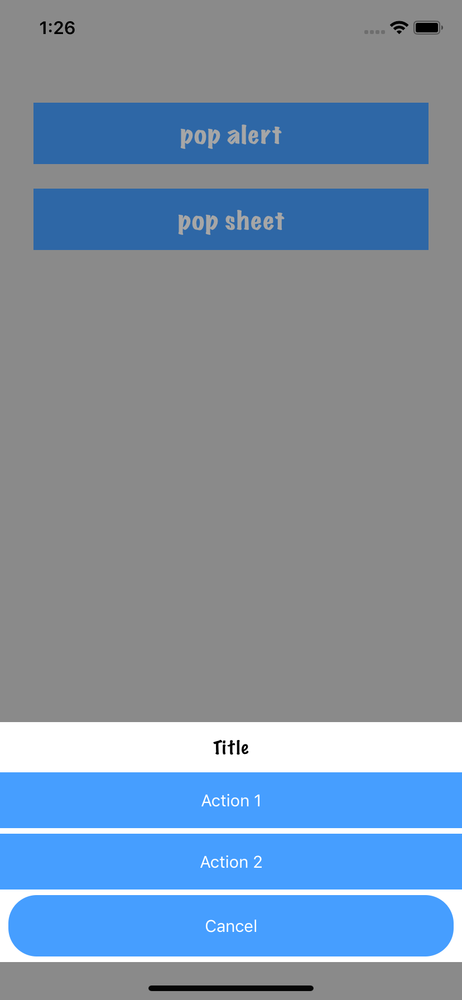

ViewControllerTransitions
=========================

## 核心思想
抽离转场动画，使用户只需关心UI样式。

2种风格样式：`RTAnimationTransitionStyleAlert`、`RTAnimationTransitionStyleSheet`。

<div style="text-align: center">
        
        
</div>

## 使用方法

使自定义的`UIViewController`遵守`RTPopAnimatedDelegate`协议。

```objc

#import "RTPopAnimatedDelegate.h"

@interface SheetViewController : UIViewController<RTPopAnimatedDelegate>

@end

...

- (RTAnimationTransitionStyle)animatedTransitionStyle {
    return RTAnimationTransitionStyleSheet;
}


```
